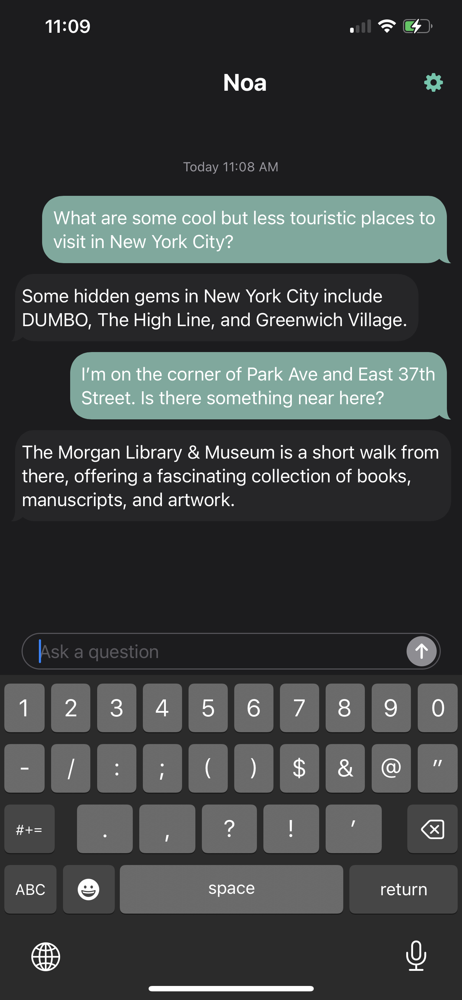
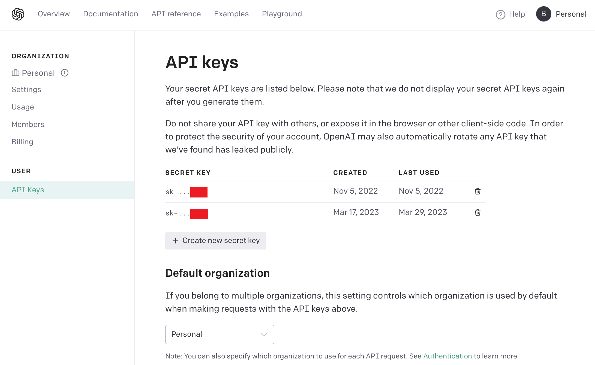

# Noa for iOS: AI Chat for Frame with iOS Devices
*Copyright 2023 Brilliant Labs Ltd.*

## Overview

*Noa for iOS* is an application that pairs to your Frame and empowers you with access to ChatGPT anywhere you need it. Simply tap to speak a question and see the response appear in your field of view. The iOS application can also function as a standalone chat interface to ChatGPT, allowing queries to be entered via the iOS keyboard.

## Getting Started

Getting started is easy:

- [Install the iOS app](https://apps.apple.com/us/app/argpt/id6450499355).
- [Obtain an OpenAI API key](https://platform.openai.com/). Obtaining a new API key is straightforward from the account management page, shown below. If you have not already done so, you will need to register an OpenAI account and set up billing. For peace of mind, we recommend new users set very low usage limits (under *Billing* and *Usage Limits*). For example, a soft limit of $5 and a hard limit of $10 will be more than sufficient for casual users and is highly unlikely to be reached in a single month.

- Open the app and power up Frame!

## For Developers

We encourage developers to extend *Noa for iOS* or to use it as a template project for their own Frame apps. This section provides a brief overview of the program structure.

### Key iOS App Source Files

The iOS project is located in `ios/Noa/`. Open `ios/Noa/Noa.xcodeproj` using Xcode. All source files and assets are in `ios/Noa/Noa/`. The key files to start with are:

- `NoaApp.swift`: *Noa for iOS* is a SwiftUI app and this is the main module. It defines the top-level SwiftUI view and instantiates a very important object of class `Controller` that handles program logic, including communication with Frame.
- `Controller.swift`: The main program controller and the heart of the app. Performs the following:
    - Subcribes to `pairedDeviceID` setting: This determines which Frame device we are "paired" to. Bluetooth bonding is not performed. Rather, the iOS app stores a device ID that it uses to connect to Frame each time. When this is changed, by explicitly unpairing or connecting to a nearby device using the in-app UI, `Controller` notifies the Bluetooth manager. If the device ID has changed, the Bluetooth manager will disconnect from the current device and attempt to connect to the new one.
    - Subscribes to Bluetooth events on the Frame `BluetoothManager` object:
        - `discoveredDevices`: While not connected, `BluetoothManager` scans for nearby Frame devices and publishes them. The nearest device, as determined by RSSI (received signal strength indicator), is broadcast on the `nearestFrameID` variable. During pairing, this will be used when the user decides to connect.
        - `peripheralConnected`: Fires whenever a connection with a Frame device is established. This kicks off a state machine that uploads Lua scripts to Frame and handles bi-directional communication between the iOS app and Frame.
        - `peripheralDisconnected`: Indicates Frame has disconnected.
        - `dataReceived`: Data has been received on either the serial Tx or data Tx characteristic. Frame uses the serial characteristic as its standard output and the iOS app monitors it to ensure Frame is in the intended state each step of the way. The data characteristic is used for app-specific messaging (commands from and to Frame scripts).
    - Subscribe to Bluetooth events on the DFU `BluetoothManager` object. When uploading firmware, Frame is placed in DFU (device firmware update) mode, a special mode implemented by its microcontroller that causes it to appear as an entirely different `DfuTarg` peripheral. [Nordic's DFU package](https://github.com/NordicSemiconductor/IOS-DFU-Library) handles the update.
    - Accepts queries from both Frame (as voice data) or the app's chat window (as text strings) to pass on to ChatGPT.
    - Transmits required Lua scripts to Frame using a simple state machine. Frame is first placed into raw REPL mode.
    - Performs firmware and FPGA updates if needed using a series of states in the state machine.
    - Sends user queries to ChatGPT and then forwards the results to both the the iOS chat window and Frame.
- `Bluetooth/BluetoothManager.swift`: The Bluetooth interface. Uses Apple's [CoreBluetooth framework](https://developer.apple.com/documentation/corebluetooth). Connects to Frame devices, provides bi-directional communication via the serial and data characteristics, and forwards all events using [Combine](https://developer.apple.com/documentation/combine) publishers.
- `OpenAI/ChatGPT.swift`: Submits requests to ChatGPT maintaining a conversational history. When the history limit is exceeded, the history is automatically cleared. Attempts to perform background URL requests so that the app can function with the screen off.
- `OpenAI/Whisper.swift`: Submits audio to Whisper for transcription. Note that audio is first converted to M4A format by `Controller`.
- `Chat/`: This subdirectory contains all chat-related model (data) objects that represent a conversation and are rendered by the UI.
- `Views/`: All SwiftUI views are implemented here.
- `Settings/`: The `Settings` class provides an interface for the app's settings, allowing e.g. the GPT model version to be changed. Changes to settings are published.
- `Speech/`: Audio processing code used to prepare audio buffers received from Frame for submission to Whisper.

### Frame Scripts, Firmware, and FPGA Images

The Lua code that runs on Frame is stored in `ios/Noa/Noa/Frame Assets/Scripts/`. All files are uploaded to Frame, which is then instructed to run `main.lua`. Communication with the iOS app uses the data characteristic.

Firmware is stored in `ios/Noa/Noa/Frame Assets/Firmware/`. Each time Frame connects, the app checks the current firmware
version to make sure it is the one expected by *Noa* and if needed, uploads the correct version.

FPGA images are located in `ios/Noa/Noa/Frame Assets/FPGA/`. The app also checks to ensure the correct FPGA image is loaded.

### iOS/Frame Communication Flow

From the perspective of the iOS companion app, communication with Frame is driven by a state machine:

- `disconnected`: Nothing to do. Waiting for connection to Frame.
- `waitingForRawREPL`: On connect, iOS app transmits control codes over the serial characteristic that put Frame in raw REPL mode. This state is then entered and monitors the serial characteristic for confirmation that this has succeeded. Once confirmed, the app moves on to `waitingForFirmwareVersion`.
- `waitingForFirmwareVersion`: Waits to obtain the firmware version. Once received, uses the firmware version to determine whether it needs to be updated. Proceeds first with the firmware, which will reboot the device. When this state is reached again, the firmware version will be correct and the FPGA update will be carried out next, if needed. Otherwise, asks Frame to `print(FRAME_FIRMWARE_VERSION)` and proceeds to `waitingForScriptVersion`.
- `waitForScriptVersion`: If `FRAME_FIRMWARE_VERSION` is defined and matches the expected version string, the app enters the `running` state. Otherwise, it loads the required Lua scripts and begins transmitting them one after another.
- `transmitingFiles`: This state monitors the serial characteristic to ensure the most recent file has been accepted before kicking off the next transfer. Once finished, the `running` state is entered.
- `running`: The app is running and responding to commands on the data characteristic.
- `initiateDFUAndWaitForDFUTarget`: The first state in the firmware update sequence. This initiates DFU mode, which will cause Frame to disconnect and reappear as a different device: `DfuTarg`. When in this state, the DFU target `BluetoothManager` is enabled and permitted to connect.
- `performDFU`: Once the DFU target has connected, the DFU process is performed. The device will automatically reboot and Frame will reappear.
- `initiateFPGAUpdate`: When the FPGA image must be upgraded, this state begins the process by commanding Frame to erase the FPGA.
- `waitForFPGAErased`: Waits for confirmation that the FPGA erase command has completed.
- `sendNextFPGAImageChunk`: This state is used to send over the FPGA image in chunks.
- `writeFPGAAndReset`: When all chunks have been transmitted, a command is set to write the FPGA image and reset the device.

The state machine makes use of the Swift language's data-carrying enum feature to pass some state information in the state enums themselves. Some state is also retained through members of `Controller`. In order to present a single progress bar during the firmware and FPGA update sequences, the app needs to know whether a DFU update has just completed in order to properly scale the FPGA progress percentage. This is done by passing a `didFinishDFU` boolean with the initial states. In other words, this is purely for cosmetic purposes.

The `running` state is where most of the work happens. Frame communicates with the app using a simple protocol. All commands are handled in `onFrameCommand` in `Controller.swift`. Although technically stateful, the protocol was designed so that the iOS app can simply react to each command. Each command is 4 characters followed by optional command-specific data:

- `ast:`: Audio start. Frame will send over a new audio stream. The current buffered audio should be deleted.
- `dat:` Audio data. Audio data is sent across sequentially, one MTU-sized chunk at a time and is stored in a buffer.
- `aen:` Audio end. Frame has finished transmitting audio. The iOS app can now transmit the audio to OpenAI for transcription. When transcription is finished, the result is stored in a map and assigned a unique transcription ID. The ChatGPT request is *not* kicked off automatically because multiple background mode URL requests are not permitted. Instead, the transcription ID is sent back to Frame (`pin:` command, for "ping"), which will then send it right back ("pong") to kick off a new background request.
- `pon:` Transcription request pong. Frame sends the transcription ID back to us, which would be completely redundant except for the fact that it should hopefully wake our app up a second time when in background mode allowing a new URL request to be sent to OpenAI for GPT. When this completes, the response message is sent using a `res:` command to Frame, which displays the result.

### Translation Support

*Noa* supports translation from any language supported by Whisper to English. Enable this in the settings menu. When speaking through Frame, Whisper is used to perform this translation automatically without involving ChatGPT. When using the iOS app to type statements, ChatGPT *is* employed. `Controller` operates in two modes, *assistant* and *translator*. The mode is passed to the ChatGPT module, which uses a different system prompt for each to accomplish the desired task.

### Python Script Versioning

A SHA-256 digest is computed from the Lua scripts and their filenames by concatenating them all together. Then, just before transmitting them, the version string is inserted into the source code. Therefore, if *Noa for iOS* is already running on Frame, `FRAME_FIRMWARE_VERSION` will have been defined and can be checked against the iOS app's Lua scripts.

### Audio Format

As of the initial version, 8-bit 8KHz mono audio is sent from Frame in order to minimize the transmission time. iOS `AVAudioPCMBuffer` does not support this format natively but the conversion to a 16-bit buffer is trivial.

Whisper expects 16-bit 16KHz audio. A drawback of the 8-bit sampling is loss of dynamic range and increased sensitivity to background noise.
